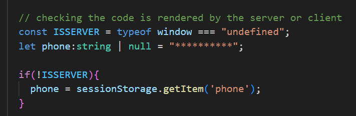

# I have made a component named navbar and inside it i have another component named sidebar. there is a file named navlinks inside it i have made a array of objects 

I want to render it here as a icon property

Solution: 
SOLUTIOn :- 1

link :- https://blog.logrocket.com/using-dangerouslysetinnerhtml-in-a-react-application/

I used **dangerouslysetinnerhtml** to set the icon in the string format and then rendered it using another div tag.

SOLUTION :- 2

But this solution is probematic b/c sometimes the svg images can be large so i stored the svg images in public folder and now added link in icon property of navLinks file.

# local storage is giving the problem saying that localstroage / sessionStorage is not defined.    
    1. https://stackoverflow.com/questions/59540321/in-react-and-next-js-constructor-i-am-getting-reference-error-localstorage-is
    2. https://developer.school/snippets/react/localstorage-is-not-defined-nextjs

the problem is that the code of sessionStorahe is working fine when it is running on the client side. But when nextjs tries to run it on server for static sote generation. it is not able to do that.b/c sessionStorage doesnt exist on server.

SOLUTION :- 