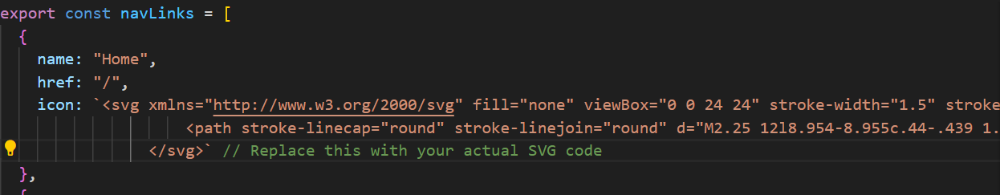
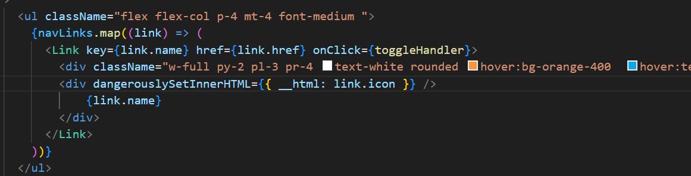
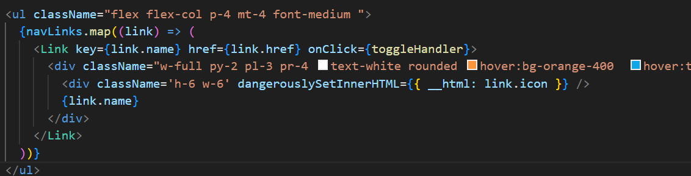

1. I have made a component named navbar and inside it i have another component named sidebar. there is a file named navlinks inside it i have made a array of objects 

I want to render it here as a icon property

Solution: 
link :- https://blog.logrocket.com/using-dangerouslysetinnerhtml-in-a-react-application/

I used **dangerouslysetinnerhtml** to set the icon in the string format and then rendered it using another div tag.
